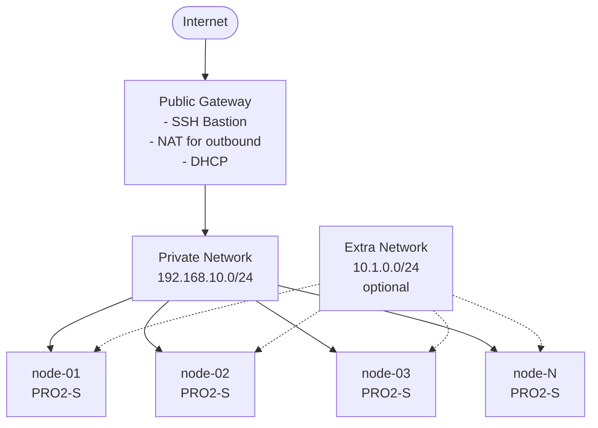

# Multi-Cloud Platform Spawner

A production-grade infrastructure-as-code solution using Pulumi and Python to deploy configurable clusters with any number of worker nodes across cloud providers.

## Overview

This project deploys Rocky Linux clusters with flexible configuration:

- **Any number of worker nodes**: 1, 3, 6, 12, 50, or any positive integer
- **Resource naming prefixes**: Organize resources with custom prefixes (dev, staging, prod, etc.)
- **Private network architecture**: All workers on private network with gateway bastion for SSH access
- **Custom or marketplace images**: Use pre-configured snapshots or fresh marketplace images
- **Additional volumes**: Attach multiple volumes per worker node with flexible sizing
- **Extra private networks**: Attach multiple network interfaces for multi-homed instances

The architecture is designed for multi-cloud support with clean abstractions, starting with Scaleway.

**Two ways to use this project:**
- **[CLI Usage](#cli-usage)**: Direct Pulumi commands for local development and manual deployments
- **[GitHub Action Usage](#github-action-usage)**: Automated deployments in CI/CD pipelines

---

# CLI Usage

Use Pulumi CLI directly for local development, testing, and manual infrastructure management.

## Prerequisites

- **Python 3.8+**
- **Pulumi CLI**: [Install Pulumi](https://www.pulumi.com/docs/get-started/install/)
- **Scaleway Account** with API credentials
- **uv** (optional): Fast Python package installer

## Installation

```bash
# Install dependencies
uv pip install -r requirements.txt

# Alternative: traditional pip
pip install -r requirements.txt
```

## Quick Start

```bash
# Install dependencies
uv pip install -r requirements.txt

# Configure
pulumi stack init dev
pulumi config set project_id YOUR_SCALEWAY_PROJECT_ID
pulumi config set worker_count 3
pulumi config set name_prefix dev
pulumi config set --secret scaleway:access_key YOUR_ACCESS_KEY
pulumi config set --secret scaleway:secret_key YOUR_SECRET_KEY

# Deploy
pulumi up

# Access nodes
pulumi stack output nodes --json | jq -r '.[] | .ssh_command'
```

## CLI Configuration

### Required Parameters

```bash
pulumi config set project_id YOUR_SCALEWAY_PROJECT_ID
pulumi config set worker_count 3  # Any positive integer
pulumi config set --secret scaleway:access_key YOUR_KEY
pulumi config set --secret scaleway:secret_key YOUR_SECRET
```

### Optional Parameters

```bash
# Resource naming
pulumi config set name_prefix prod                    # Prefix for all resources

# Instance configuration
pulumi config set instance_type PRO2-S                # Worker instance type
pulumi config set worker_snapshot_id YOUR_SNAPSHOT_ID # Custom image for workers

# Location
pulumi config set region fr-par                       # Default: fr-par
pulumi config set zone fr-par-1                       # Default: fr-par-1

# Security - Gateway bastion access control (IMPORTANT for production!)
pulumi config set allowed_ips "1.2.3.4/32,5.6.7.8/32" # IPs allowed to SSH to gateway (default: 0.0.0.0/0)

# Marketplace OS (used only if worker_snapshot_id not set)
pulumi config set bastion_os_name rockylinux         # Default: rockylinux
pulumi config set bastion_os_version 9               # Default: 9

# Additional volumes (JSON array)
pulumi config set additional_volumes '[{"suffix":"service","size":120},{"suffix":"data","size":10,"count":12}]'

# Extra private networks for multi-homed instances (JSON array)
pulumi config set extra_private_networks '[{"suffix":"data","subnet":"10.1.0.0/24"}]'
```

## CLI Examples

### Development Environment (1 Worker)

```bash
pulumi config set worker_count 1
pulumi config set name_prefix dev
pulumi config set instance_type PLAY2-MICRO
pulumi up
```

**Creates**: `dev-node-01`, `dev-vpc`, `dev-gateway`, `dev-internal`

### Production Environment (6 Workers)

```bash
pulumi config set worker_count 6
pulumi config set name_prefix prod
pulumi config set instance_type PRO2-S
pulumi config set worker_snapshot_id YOUR_SNAPSHOT_ID
pulumi up
```

**Creates**: `prod-node-01` through `prod-node-06`, `prod-vpc`, `prod-gateway`

### Large Scale (20 Workers)

```bash
pulumi config set worker_count 20
pulumi config set name_prefix prod-large
pulumi config set instance_type PRO2-M
pulumi up
```

**Creates**: 20 worker nodes with large instance type

### Multi-Environment Deployments

Use separate stacks for different environments:

```bash
# Development
pulumi stack init dev
pulumi config set worker_count 1
pulumi config set name_prefix dev
pulumi config set instance_type PLAY2-MICRO
pulumi up --stack dev

# Staging
pulumi stack init staging
pulumi config set worker_count 3
pulumi config set name_prefix staging
pulumi config set instance_type PRO2-S
pulumi up --stack staging

# Production
pulumi stack init prod
pulumi config set worker_count 6
pulumi config set name_prefix prod
pulumi config set instance_type PRO2-M
pulumi up --stack prod
```

## CLI Cleanup

```bash
# Preview deletion
pulumi destroy --preview

# Destroy all resources
pulumi destroy
```

## CLI Troubleshooting

### Authentication Errors

```bash
# Verify credentials
pulumi config get scaleway:access_key
pulumi config get scaleway:secret_key

# Re-set if needed
pulumi config set --secret scaleway:access_key YOUR_KEY
pulumi config set --secret scaleway:secret_key YOUR_SECRET
```

### Image Not Found

```bash
# Use marketplace image instead of snapshot
pulumi config rm worker_snapshot_id
pulumi config set bastion_os_name rockylinux
pulumi config set bastion_os_version 9
```

### Network Connectivity

```bash
# Verify gateway is running
pulumi stack output gateway_bastion_ip

# Check private network configuration
pulumi stack output network
```

---

# GitHub Action Usage

Use the `platform-spawner` GitHub Action for automated deployments in CI/CD workflows.

## Action Reference

```yaml
- uses: scality/platform-spawner@v2
  with:
    action: spawn  # spawn, destroy, list, or setup
    # ... inputs
```

### Action Inputs

| Input | Required | Default | Description |
|-------|----------|---------|-------------|
| `action` | No | `spawn` | Action to perform: `spawn`, `destroy`, `list`, or `setup` |
| `stack_name` | Yes* | - | Unique name for the Pulumi stack (*required for spawn/destroy) |
| `configuration` | No | - | YAML configuration for the Pulumi stack |
| `product` | No | `""` | Product name prefix for resources |
| `scaleway_access_key` | Yes | - | Scaleway API access key |
| `scaleway_secret_key` | Yes | - | Scaleway API secret key |
| `scaleway_project_id` | Yes | - | Scaleway project ID |
| `ssh_public_keys` | No | `[]` | JSON array of SSH public keys |
| `ssh_key_name` | No | `""` | Name of existing SSH key in cloud provider |
| `ssh_private_key_create` | No | `false` | Generate a new SSH keypair |
| `authorized_cidrs` | No | `""` | CIDRs allowed to access bastion |
| `custom_routes` | No | `""` | Custom VPC routes (JSON array) |
| `store_to_s3` | No | `true` | Store stack output in S3 for garbage collection |
| `age` | No | - | Age in hours to list stacks (for `list` action) |

### Action Outputs

| Output | Description |
|--------|-------------|
| `bastion` | Bastion/gateway connection information |
| `nodes` | Deployed nodes information (JSON) |
| `stacks_list` | List of stacks (for `list` action) |

### Configuration Options (YAML)

The `configuration` input accepts YAML with these options:

| Parameter | Type | Default | Description |
|-----------|------|---------|-------------|
| `instance_image` | string | **required** | Image/snapshot ID for instances |
| `instance_count` | integer | `3` | Number of worker nodes |
| `instance_flavor` | string | `medium` | Instance size: `small`, `medium`, `medium-plus`, `large` |
| `instance_root_disk_size` | integer | `50` | Root disk size in GiB |
| `extra_volumes` | JSON | `[]` | Additional volumes (see format below) |
| `extra_private_networks` | JSON | `[]` | Extra private networks (see format below) |

## GitHub Action Examples

### Basic Single-Node Deployment

```yaml
jobs:
  deploy:
    runs-on: ubuntu-latest
    steps:
      - name: Generate SSH Key
        id: ssh-key
        run: |
          ssh-keygen -t ed25519 -f /tmp/id_ed25519 -N ""
          echo "public_key_array=[\"$(cat /tmp/id_ed25519.pub)\"]" >> $GITHUB_OUTPUT

      - name: Spawn cluster
        id: spawn
        uses: scality/platform-spawner@v2
        with:
          action: spawn
          stack_name: my-cluster-${{ github.run_number }}
          product: my-app-${{ github.run_number }}
          configuration: |
            instance_image: ${{ vars.SNAPSHOT_ID }}
            instance_flavor: medium
            instance_count: 1
            instance_root_disk_size: 100
          ssh_public_keys: ${{ steps.ssh-key.outputs.public_key_array }}
          scaleway_access_key: ${{ secrets.SCW_ACCESS_KEY }}
          scaleway_secret_key: ${{ secrets.SCW_SECRET_KEY }}
          scaleway_project_id: ${{ secrets.SCW_PROJECT_ID }}
```

### Production Deployment with Extra Networks

```yaml
- name: Spawn production cluster
  uses: scality/platform-spawner@v2
  with:
    action: spawn
    stack_name: prod-cluster-${{ github.run_number }}
    product: production-${{ github.run_number }}
    configuration: |
      instance_image: ${{ inputs.snapshot-id }}
      instance_flavor: medium-plus
      instance_count: 3
      instance_root_disk_size: 100
      extra_volumes: '[{"suffix": "data", "size": 500, "count": 1}]'
      extra_private_networks: '[{"suffix": "data", "subnet": "10.1.0.0/24"}]'
    ssh_public_keys: ${{ steps.ssh-key.outputs.public_key_array }}
    authorized_cidrs: "52.161.62.16/28,52.159.241.192/28"
    custom_routes: |
      [{"destination": "35.241.243.135/32", "description": "artifacts.scality.net"}]
    scaleway_access_key: ${{ secrets.SCW_ACCESS_KEY }}
    scaleway_secret_key: ${{ secrets.SCW_SECRET_KEY }}
    scaleway_project_id: ${{ secrets.SCW_PROJECT_ID }}
```

### Multi-Homed Instance with Dual Networks

```yaml
- name: Spawn cluster with dual networks
  uses: scality/platform-spawner@v2
  with:
    action: spawn
    stack_name: dual-net-${{ github.run_number }}
    product: dual-net-${{ github.run_number }}
    configuration: |
      instance_image: ${{ inputs.snapshot-id }}
      instance_flavor: large
      instance_count: 3
      extra_private_networks: |
        [
          {"suffix": "data", "subnet": "10.1.0.0/24"},
          {"suffix": "storage", "subnet": "10.2.0.0/24"}
        ]
    ssh_public_keys: ${{ steps.ssh-key.outputs.public_key_array }}
    scaleway_access_key: ${{ secrets.SCW_ACCESS_KEY }}
    scaleway_secret_key: ${{ secrets.SCW_SECRET_KEY }}
    scaleway_project_id: ${{ secrets.SCW_PROJECT_ID }}
```

### Destroy Cluster

```yaml
- name: Destroy cluster
  uses: scality/platform-spawner@v2
  with:
    action: destroy
    stack_name: my-cluster-${{ github.run_number }}
    scaleway_access_key: ${{ secrets.SCW_ACCESS_KEY }}
    scaleway_secret_key: ${{ secrets.SCW_SECRET_KEY }}
    scaleway_project_id: ${{ secrets.SCW_PROJECT_ID }}
```

### List Old Stacks (Garbage Collection)

```yaml
- name: List stacks older than 24 hours
  id: list
  uses: scality/platform-spawner@v2
  with:
    action: list
    age: 24
    scaleway_access_key: ${{ secrets.SCW_ACCESS_KEY }}
    scaleway_secret_key: ${{ secrets.SCW_SECRET_KEY }}
    scaleway_project_id: ${{ secrets.SCW_PROJECT_ID }}

- name: Show old stacks
  run: echo "${{ steps.list.outputs.stacks_list }}"
```

### Complete CI/CD Workflow Example

```yaml
name: Integration Tests

on:
  push:
    branches: [main]
  pull_request:

jobs:
  test:
    runs-on: ubuntu-latest
    steps:
      - uses: actions/checkout@v4

      - name: Generate SSH Key
        id: ssh-key
        run: |
          ssh-keygen -t ed25519 -f /tmp/id_ed25519 -N ""
          echo "public_key_array=[\"$(cat /tmp/id_ed25519.pub)\"]" >> $GITHUB_OUTPUT

      - name: Spawn test cluster
        id: spawn
        uses: scality/platform-spawner@v2
        with:
          action: spawn
          stack_name: test-${{ github.run_number }}
          product: test-${{ github.run_number }}
          configuration: |
            instance_image: ${{ vars.SNAPSHOT_ID }}
            instance_flavor: medium
            instance_count: 1
          ssh_public_keys: ${{ steps.ssh-key.outputs.public_key_array }}
          scaleway_access_key: ${{ secrets.SCW_ACCESS_KEY }}
          scaleway_secret_key: ${{ secrets.SCW_SECRET_KEY }}
          scaleway_project_id: ${{ secrets.SCW_PROJECT_ID }}

      - name: Run tests
        run: |
          echo "Bastion: ${{ steps.spawn.outputs.bastion }}"
          echo "Nodes: ${{ steps.spawn.outputs.nodes }}"
          # Run your tests here

      - name: Cleanup
        if: always()
        uses: scality/platform-spawner@v2
        with:
          action: destroy
          stack_name: test-${{ github.run_number }}
          scaleway_access_key: ${{ secrets.SCW_ACCESS_KEY }}
          scaleway_secret_key: ${{ secrets.SCW_SECRET_KEY }}
          scaleway_project_id: ${{ secrets.SCW_PROJECT_ID }}
```

---

# Common Configuration Reference

## Configuration Parameters

| Parameter | Type | Default | Description |
|-----------|------|---------|-------------|
| `instance_count` / `worker_count` | integer | **required** | Number of worker nodes (1, 3, 6, 12, etc.) |
| `project_id` | string | **required** | Scaleway project ID |
| `instance_image` | string | **required** | Image/snapshot ID for instances |
| `name_prefix` / `product` | string | `""` | Prefix for all resource names |
| `instance_flavor` / `instance_type` | string | `medium` / `PRO2-S` | Worker node instance type |
| `instance_root_disk_size` | integer | `50` | Root disk size in GiB |
| `region` | string | `fr-par` | Scaleway region |
| `zone` | string | `fr-par-1` | Scaleway availability zone |
| `authorized_cidrs` / `allowed_ips` | string | `0.0.0.0/0` | IPs/CIDRs allowed for bastion SSH |
| `ssh_key_name` | string | `""` | Name of existing SSH key |
| `ssh_public_keys` | JSON array | `[]` | SSH public keys to inject |
| `ssh_private_key_create` | boolean | `false` | Generate a new SSH keypair |
| `extra_volumes` | JSON | `[]` | Additional volumes config |
| `extra_private_networks` | JSON | `[]` | Extra private networks config |

## Instance Flavors

| Flavor | Scaleway Type | vCPUs | RAM | Use Case |
|--------|---------------|-------|-----|----------|
| `tiny` | `PLAY2-PICO` | 1 | 1 GB | Minimal testing |
| `small` | `PLAY2-NANO` | 2 | 2 GB | Bastion, light workloads |
| `medium` | `PRO2-S` | 4 | 8 GB | Development, small prod |
| `medium-plus` | `PRO2-M` | 8 | 16 GB | Production |
| `large` | `PRO2-L` | 16 | 32 GB | High-performance |
| `xlarge` | `PRO2-XL` | 32 | 64 GB | Heavy workloads |

**Note**: Gateway always uses `VPC-GW-S` (managed by Scaleway)

---

# Architecture



## Security Model

- **Gateway bastion**: Single SSH entry point (port 61000)
- **IP-based access control**: Optionally restrict gateway bastion access to specific IPs
- **Private-only workers**: No direct internet exposure
- **NAT**: Outbound internet access via gateway
- **Security groups**: Network isolation and firewall rules
- **Internal communication**: Via private network (192.168.10.0/24)
- **Multi-homed support**: Optional extra networks for traffic isolation

---

# Output Structure

## Pulumi Outputs

After deployment, view your infrastructure:

```bash
# View all outputs
pulumi stack output --json

# Get gateway IP
pulumi stack output gateway_bastion_ip

# Get SSH commands for all nodes
pulumi stack output nodes --json | jq -r '.[] | .ssh_command'
```

## Output JSON Structure

```json
{
  "instance_count": 3,
  "gateway_bastion_ip": "51.159.x.x",
  "bastion": {
    "type": "gateway",
    "ip": "51.159.x.x",
    "port": 61000,
    "user": "bastion"
  },
  "nodes": {
    "prod-node-01": {
      "id": "fr-par-1/11111111-1111-...",
      "urn": "urn:pulumi:dev::platform-spawner::...",
      "name": "prod-node-01",
      "instance_type": "PRO2-S",
      "private_ip": "192.168.10.2",
      "ssh_command": "ssh -J bastion@51.159.x.x:61000 artesca-os@prod-node-01.prod-internal.internal",
      "volumes": [
        {
          "id": "22222222-2222-...",
          "name": "prod-node-01-service",
          "size_gb": 120
        }
      ]
    }
  },
  "network": {
    "vpc_id": "...",
    "private_network_id": "...",
    "subnet": "192.168.10.0/24",
    "gateway_id": "...",
    "extra_networks": {
      "data": {
        "id": "...",
        "subnet": "10.1.0.0/24"
      }
    }
  }
}
```

---

# Additional Features

## SSH Access

### SSH Command Format

```
ssh -J bastion@<gateway_ip>:61000 artesca-os@<node_name>.<network_name>.internal
```

### Get SSH Commands

```bash
# Get SSH command for a specific node
SSH_CMD=$(pulumi stack output nodes --json | jq -r '."prod-node-01".ssh_command')
echo $SSH_CMD

# Connect directly
eval $SSH_CMD

# List all SSH commands
pulumi stack output nodes --json | jq -r '.[] | "\(.name): \(.ssh_command)"'
```

## Additional Volumes

Attach multiple block storage volumes per worker node:

```bash
# CLI: Single service volume (120GB) + 12 data volumes (10GB each)
pulumi config set additional_volumes '[
  {"suffix": "service", "size": 120},
  {"suffix": "data", "size": 10, "count": 12}
]'
```

```yaml
# GitHub Action
configuration: |
  extra_volumes: '[{"suffix": "service", "size": 120}, {"suffix": "data", "size": 10, "count": 12}]'
```

### Volume Configuration Format

| Field | Type | Required | Default | Description |
|-------|------|----------|---------|-------------|
| `suffix` | string | No | `data` | Identifier suffix for the volume |
| `size` | integer | **Yes** | - | Volume size in GB |
| `count` | integer | No | `1` | Number of volumes to create |

**Naming**: `{prefix}-node-{index}-{suffix}` (e.g., `prod-node-01-service`, `prod-node-01-data-01`)

## Extra Private Networks (Multi-Homed Instances)

Attach multiple private network interfaces to each worker node for network isolation:

```bash
# CLI: Add a second network interface for data traffic
pulumi config set extra_private_networks '[
  {"suffix": "data", "subnet": "10.1.0.0/24"}
]'

# CLI: Multiple network interfaces (data + storage)
pulumi config set extra_private_networks '[
  {"suffix": "data", "subnet": "10.1.0.0/24"},
  {"suffix": "storage", "subnet": "10.2.0.0/24"}
]'
```

```yaml
# GitHub Action
configuration: |
  extra_private_networks: '[{"suffix": "data", "subnet": "10.1.0.0/24"}]'
```

### Network Configuration Format

| Field | Type | Required | Default | Description |
|-------|------|----------|---------|-------------|
| `suffix` | string | No | `extra` | Identifier suffix for the network |
| `subnet` | string | **Yes** | - | CIDR block for the private network |
| `count` | integer | No | `1` | Number of NICs per network (typically 1) |

### Use Cases

- **Network Isolation**: Separate management traffic from data traffic
- **Storage Networks**: Dedicated network for storage replication
- **Multi-Tenancy**: Isolated networks for different applications
- **High Availability**: Redundant network paths

## Image Management

### Custom Snapshot (Recommended for Production)

Pre-configured images with your software stack:

```bash
# CLI
pulumi config set worker_snapshot_id 11111111-2222-3333-4444-555555555555
```

```yaml
# GitHub Action
configuration: |
  instance_image: 11111111-2222-3333-4444-555555555555
```

### Marketplace Image (Development/Testing)

Fresh OS from Scaleway marketplace - used when no snapshot ID is provided.

## Snapshot Workflow

Before destroying infrastructure, snapshot all resources:

```bash
# Snapshot all worker nodes
for node_id in $(pulumi stack output nodes --json | jq -r '.[] | .id'); do
  scw instance server backup \
    server-id=$node_id \
    zone=fr-par-1 \
    name="backup-$(date +%Y%m%d-%H%M%S)"
done

# Snapshot all volumes
pulumi stack output nodes --json | jq -r '.[] | .volumes[] | .id' | while read volume_id; do
  scw instance snapshot create \
    volume-id=$volume_id \
    zone=fr-par-1 \
    name="volume-backup-$(date +%Y%m%d-%H%M%S)"
done
```

---

# Best Practices

## Production Deployments

1. **Use production instance types**: `PRO2-S` or larger for workers
2. **Use custom snapshots**: Pre-configured images for faster, consistent deployments
3. **Add name prefixes**: Organize resources with environment prefixes
4. **Configure IP access control**: Restrict gateway bastion access to known IPs
5. **Enable monitoring**: Use Scaleway's monitoring and alerting
6. **Regular backups**: Snapshot nodes and volumes before major changes
7. **Version control**: Track all configuration in Git
8. **Separate stacks**: Dev, staging, prod in different stacks

## Security Best Practices

1. **IP Allowlisting** (critical for production):

   Restrict gateway bastion SSH access to specific IP addresses:
   
   ```bash
   # CLI: Single office IP
   pulumi config set allowed_ips "203.0.113.10/32"

   # CLI: Multiple IPs (office + VPN)
   pulumi config set allowed_ips "203.0.113.10/32,198.51.100.0/24"
   ```
   
   ```yaml
   # GitHub Action
   authorized_cidrs: "203.0.113.10/32,198.51.100.0/24"
   ```

   **Important**: By default, the gateway bastion is accessible from all IPs (`0.0.0.0/0`).
   Always configure IP restrictions for production deployments.

2. **SSH Key Management**: Four options are available:

   | Option | Config | Description |
   |--------|--------|-------------|
   | **Default** | *(none)* | Scaleway provides all IAM keys to instance automatically |
   | **Existing key** | `ssh_key_name` | Use an existing SSH key by name from cloud provider |
   | **Generate new** | `ssh_private_key_create` | Generate a new keypair (registered in IAM + cloud-init) |
   | **Provide key** | `ssh_public_keys` | Provide public keys (registered in IAM + cloud-init) |

3. **Private-Only Workers**: Workers have no public IPs and are only accessible via the gateway bastion

4. **Regular Key Rotation**: Gateway automatically refreshes SSH keys from IAM

5. **Non-Standard SSH Port**: Gateway bastion uses port 61000 instead of 22

## Cost Optimization

- **Development**: Use `small` or `tiny` flavors
- **Destroy dev environments**: When not in use
- **Right-size**: Use appropriate worker counts per environment (dev: 1, staging: 3, prod: 6+)

---

# Project Structure

```
platform-spawner/
├── __main__.py              # Entry point
├── action.yaml              # GitHub Action definition
├── Pulumi.yaml              # Project metadata
├── requirements.txt         # Python dependencies
│
├── core/                    # Provider-agnostic abstractions
│   ├── interfaces.py        # Abstract base classes
│   ├── models.py            # Data models
│   ├── topology.py          # Node configurations
│   └── factory.py           # Provider factory
│
└── providers/               # Provider implementations
    └── scaleway/
        ├── cluster.py       # Cluster orchestration
        ├── network.py       # VPC, Gateway, Private Network
        ├── compute.py       # Instances, Security Groups
        ├── images.py        # OS image lookup
        └── config.py        # Scaleway configuration
```

---

# Contributing

The project uses clean abstractions to support multiple cloud providers:

```python
# Add new provider by implementing interfaces
class AWSCluster(ClusterInterface):
    def deploy_cluster(self):
        # AWS-specific implementation
        pass
```

## License

[Your License Here]

## Support

- [Pulumi Documentation](https://www.pulumi.com/docs/)
- [Scaleway Documentation](https://www.scaleway.com/en/docs/)
- [GitHub Issues](your-repo-url/issues)
