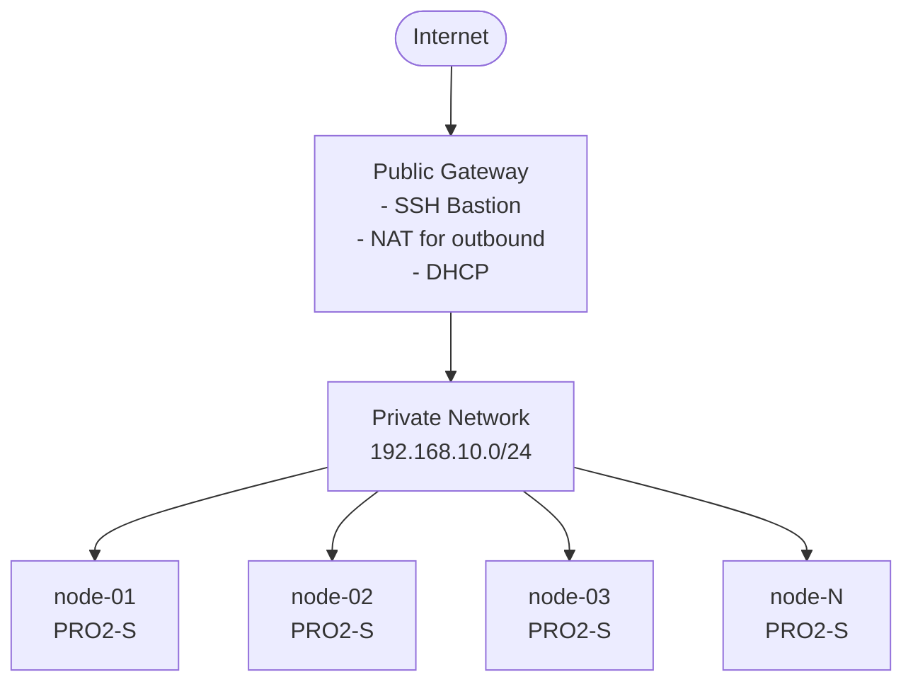

# Multi-Cloud Platform Spawner

A production-grade infrastructure-as-code solution using Pulumi and Python to deploy configurable clusters with any number of worker nodes across cloud providers.

## Overview

This project deploys Rocky Linux clusters with flexible configuration:

- **Any number of worker nodes**: 1, 3, 6, 12, 50, or any positive integer
- **Resource naming prefixes**: Organize resources with custom prefixes (dev, staging, prod, etc.)
- **Private network architecture**: All workers on private network with gateway bastion for SSH access
- **Custom or marketplace images**: Use pre-configured snapshots or fresh marketplace images
- **Additional volumes**: Attach multiple volumes per worker node with flexible sizing

The architecture is designed for multi-cloud support with clean abstractions, starting with Scaleway.

## Quick Start

```bash
# Install dependencies
uv pip install -r requirements.txt

# Configure
pulumi stack init dev
pulumi config set project_id YOUR_SCALEWAY_PROJECT_ID
pulumi config set worker_count 3
pulumi config set name_prefix dev
pulumi config set --secret scaleway:access_key YOUR_ACCESS_KEY
pulumi config set --secret scaleway:secret_key YOUR_SECRET_KEY

# Deploy
pulumi up

# Access nodes
pulumi stack output nodes --json | jq -r '.[] | .ssh_command'
```

## Prerequisites

- **Python 3.8+**
- **Pulumi CLI**: [Install Pulumi](https://www.pulumi.com/docs/get-started/install/)
- **Scaleway Account** with API credentials
- **uv** (optional): Fast Python package installer

## Installation

```bash
# Install dependencies
uv pip install -r requirements.txt

# Alternative: traditional pip
pip install -r requirements.txt
```

## Configuration

### Required Parameters

```bash
pulumi config set project_id YOUR_SCALEWAY_PROJECT_ID
pulumi config set worker_count 3  # Any positive integer
pulumi config set --secret scaleway:access_key YOUR_KEY
pulumi config set --secret scaleway:secret_key YOUR_SECRET
```

### Optional Parameters

```bash
# Resource naming
pulumi config set name_prefix prod                    # Prefix for all resources

# Instance configuration
pulumi config set instance_type PRO2-S                # Worker instance type
pulumi config set worker_snapshot_id YOUR_SNAPSHOT_ID # Custom image for workers

# Location
pulumi config set region fr-par                       # Default: fr-par
pulumi config set zone fr-par-1                       # Default: fr-par-1

# Security - Gateway bastion access control (IMPORTANT for production!)
pulumi config set allowed_ips "1.2.3.4/32,5.6.7.8/32" # IPs allowed to SSH to gateway (default: 0.0.0.0/0)

# Marketplace OS (used only if worker_snapshot_id not set)
pulumi config set bastion_os_name rockylinux         # Default: rockylinux
pulumi config set bastion_os_version 9               # Default: 9

# Additional volumes (JSON array)
pulumi config set additional_volumes '[{"suffix":"service","size":120},{"suffix":"data","size":10,"count":12}]'
```

## Configuration Reference

| Parameter | Type | Default | Description |
|-----------|------|---------|-------------|
| `worker_count` | integer | **required** | Number of worker nodes (1, 3, 6, 12, etc.) |
| `project_id` | string | **required** | Scaleway project ID |
| `name_prefix` | string | `""` | Prefix for all resource names |
| `instance_type` | string | `PRO2-S` | Worker node instance type |
| `worker_snapshot_id` | string | - | Custom snapshot for workers |
| `region` | string | `fr-par` | Scaleway region |
| `zone` | string | `fr-par-1` | Scaleway availability zone |
| `allowed_ips` | string | `0.0.0.0/0` | Comma-separated IPs/CIDRs allowed to access gateway bastion SSH (port 61000) |
| `ssh_key_name` | string | `""` | Name of an existing SSH key in cloud provider |
| `ssh_public_key` | string | `""` | SSH public key to add to cloud provider and cloud-init |
| `ssh_private_key_create` | boolean | `false` | Generate a new SSH keypair |
| `bastion_os_name` | string | `rockylinux` | OS for workers (if no snapshot) |
| `bastion_os_version` | string | `9` | OS version |
| `additional_volumes` | JSON | `[]` | Additional volumes config |

## Usage Examples

### Development Environment (1 Worker)

```bash
pulumi config set worker_count 1
pulumi config set name_prefix dev
pulumi config set instance_type PLAY2-MICRO
pulumi up
```

**Creates**: `dev-node-01`, `dev-vpc`, `dev-gateway`, `dev-internal`

### Production Environment (6 Workers)

```bash
pulumi config set worker_count 6
pulumi config set name_prefix prod
pulumi config set instance_type PRO2-S
pulumi config set worker_snapshot_id YOUR_SNAPSHOT_ID
pulumi up
```

**Creates**: `prod-node-01` through `prod-node-06`, `prod-vpc`, `prod-gateway`

### Large Scale (20 Workers)

```bash
pulumi config set worker_count 20
pulumi config set name_prefix prod-large
pulumi config set instance_type PRO2-M
pulumi up
```

**Creates**: 20 worker nodes with large instance type

## Architecture



### Security Model

- **Gateway bastion**: Single SSH entry point (port 61000)
- **IP-based access control**: Optionally restrict gateway bastion access to specific IPs
- **Private-only workers**: No direct internet exposure
- **NAT**: Outbound internet access via gateway
- **Security groups**: Network isolation and firewall rules
- **Internal communication**: Via private network (192.168.10.0/24)

## Pulumi Outputs

After deployment, view your infrastructure:

```bash
# View all outputs
pulumi stack output --json

# Get gateway IP
pulumi stack output gateway_bastion_ip

# Get SSH commands for all nodes
pulumi stack output nodes --json | jq -r '.[] | .ssh_command'
```

### Output Structure

```json
{
  "worker_count": 3,
  "gateway_bastion_ip": "51.159.x.x",
  "nodes": {
    "prod-node-01": {
      "id": "fr-par-1/11111111-1111-...",
      "urn": "urn:pulumi:dev::platform-spawner::...",
      "name": "prod-node-01",
      "instance_type": "PRO2-S",
      "private_ip": "192.168.10.2",
      "ssh_command": "ssh -J bastion@51.159.x.x:61000 artesca-os@prod-node-01.prod-internal.internal",
      "volumes": [
        {
          "id": "22222222-2222-...",
          "urn": "urn:pulumi:dev::...",
          "name": "prod-node-01-service",
          "size_gb": 120
        }
      ]
    }
  },
  "network": {
    "vpc_id": "...",
    "private_network_id": "...",
    "subnet": "192.168.10.0/24",
    "gateway_id": "..."
  }
}
```

## Accessing Your Infrastructure

### SSH to Worker Nodes

Each node includes a pre-generated SSH command:

```bash
# Get SSH command for a node
SSH_CMD=$(pulumi stack output nodes --json | jq -r '."prod-node-01".ssh_command')
echo $SSH_CMD
# Output: ssh -J bastion@51.159.x.x:61000 artesca-os@prod-node-01.prod-internal.internal

# Connect directly
eval $SSH_CMD

# Or list all SSH commands
pulumi stack output nodes --json | jq -r '.[] | "\(.name): \(.ssh_command)"'
```

### SSH Command Format

```
ssh -J bastion@<gateway_ip>:61000 artesca-os@<node_name>.<network_name>.internal
```

## Image Management

### Option 1: Custom Snapshot (Recommended for Production)

Pre-configured images with your software stack:

```bash
pulumi config set worker_snapshot_id 11111111-2222-3333-4444-555555555555
pulumi up
```

**Use cases:**
- Pre-installed Artesca OS
- Security-hardened base images
- Custom software configurations
- Faster deployment times

### Option 2: Marketplace Image (Development/Testing)

Fresh OS from Scaleway marketplace:

```bash
# Don't set worker_snapshot_id - will use marketplace image
pulumi config rm worker_snapshot_id
pulumi up
```

**Use cases:**
- Development and testing
- Quick prototyping
- Vanilla OS installations

## Additional Volumes

Attach multiple volumes per worker node:

```bash
# Single service volume (120GB) + 12 data volumes (10GB each)
pulumi config set additional_volumes '[
  {"suffix": "service", "size": 120},
  {"suffix": "data", "size": 10, "count": 12}
]'
```

Volume naming: `{prefix}-node-{index}-{suffix}`
- Example: `prod-node-01-service`, `prod-node-01-data-01`, `prod-node-01-data-02`

## Snapshot Workflow

Before destroying infrastructure, snapshot all resources:

```bash
# Snapshot all worker nodes
for node_id in $(pulumi stack output nodes --json | jq -r '.[] | .id'); do
  scw instance server backup \
    server-id=$node_id \
    zone=fr-par-1 \
    name="backup-$(date +%Y%m%d-%H%M%S)"
done

# Snapshot all volumes
pulumi stack output nodes --json | jq -r '.[] | .volumes[] | .id' | while read volume_id; do
  scw instance snapshot create \
    volume-id=$volume_id \
    zone=fr-par-1 \
    name="volume-backup-$(date +%Y%m%d-%H%M%S)"
done
```

## Instance Types

| Type | vCPUs | RAM | Use Case |
|------|-------|-----|----------|
| `PLAY2-MICRO` | 4 | 4 GB | Development |
| `PRO2-S` | 4 | 8 GB | Production (default) |
| `PRO2-M` | 8 | 16 GB | Production |
| `PRO2-L` | 16 | 32 GB | High-performance |

**Note**: Gateway always uses `VPC-GW-S` (managed by Scaleway)

## Multi-Environment Deployments

Use separate stacks for different environments:

```bash
# Development
pulumi stack init dev
pulumi config set worker_count 1
pulumi config set name_prefix dev
pulumi config set instance_type PLAY2-MICRO
pulumi up --stack dev

# Staging
pulumi stack init staging
pulumi config set worker_count 3
pulumi config set name_prefix staging
pulumi config set instance_type PRO2-S
pulumi up --stack staging

# Production
pulumi stack init prod
pulumi config set worker_count 6
pulumi config set name_prefix prod
pulumi config set instance_type PRO2-M
pulumi up --stack prod
```

## Project Structure

```
platform-spawner/
├── __main__.py              # Entry point
├── Pulumi.yaml              # Project metadata
├── requirements.txt         # Python dependencies
│
├── core/                    # Provider-agnostic abstractions
│   ├── interfaces.py        # Abstract base classes
│   ├── models.py            # Data models
│   ├── topology.py          # Node configurations
│   └── factory.py           # Provider factory
│
└── providers/               # Provider implementations
    └── scaleway/
        ├── cluster.py       # Cluster orchestration
        ├── network.py       # VPC, Gateway, Private Network
        ├── compute.py       # Instances, Security Groups
        ├── images.py        # OS image lookup
        └── config.py        # Scaleway configuration
```

## Cleanup

```bash
# Preview deletion
pulumi destroy --preview

# Destroy all resources
pulumi destroy
```

## Troubleshooting

### Authentication Errors

```bash
# Verify credentials
pulumi config get scaleway:access_key
pulumi config get scaleway:secret_key

# Re-set if needed
pulumi config set --secret scaleway:access_key YOUR_KEY
pulumi config set --secret scaleway:secret_key YOUR_SECRET
```

### Image Not Found

```bash
# Use marketplace image instead of snapshot
pulumi config rm worker_snapshot_id
pulumi config set bastion_os_name rockylinux
pulumi config set bastion_os_version 9
```

### Network Connectivity

```bash
# Verify gateway is running
pulumi stack output gateway_bastion_ip

# Check private network configuration
pulumi stack output network
```

## Best Practices

### Production Deployments

1. **Use production instance types**: `PRO2-S` or larger for workers
2. **Use custom snapshots**: Pre-configured images for faster, consistent deployments
3. **Add name prefixes**: Organize resources with environment prefixes
4. **Configure IP access control**: Restrict gateway bastion access to known IPs
5. **Enable monitoring**: Use Scaleway's monitoring and alerting
6. **Regular backups**: Snapshot nodes and volumes before major changes
7. **Version control**: Track all configuration in Git
8. **Separate stacks**: Dev, staging, prod in different stacks

### Security Best Practices

1. **IP Allowlisting** (critical for production):

   Restrict gateway bastion SSH access to specific IP addresses:
   ```bash
   # Single office IP
   pulumi config set allowed_ips "203.0.113.10/32"

   # Multiple IPs (office + VPN)
   pulumi config set allowed_ips "203.0.113.10/32,198.51.100.0/24"

   # Get your current IP and restrict to it
   curl https://api.ipify.org
   pulumi config set allowed_ips "$(curl -s https://api.ipify.org)/32"

   # CI/CD pipeline IP
   pulumi config set allowed_ips "203.0.113.10/32,192.0.2.50/32"
   ```

   **Important**: By default, the gateway bastion is accessible from all IPs (`0.0.0.0/0`).
   Always configure `allowed_ips` for production deployments to restrict SSH bastion access.

2. **SSH Key Management**: Four options are available:

   | Option | Config | Description |
   |--------|--------|-------------|
   | **Default** | *(none)* | Scaleway provides all IAM keys to instance automatically |
   | **Existing key** | `ssh_key_name` | Use an existing SSH key by name from cloud provider |
   | **Generate new** | `ssh_private_key_create` | Generate a new keypair (registered in IAM + cloud-init) |
   | **Provide key** | `ssh_public_key` | Provide a public key (registered in IAM + cloud-init) |

   ```bash
   # Option 1: Default - use all IAM keys from Scaleway project (no config needed)

   # Option 2: Use existing key by name
   pulumi config set ssh_key_name "my-existing-key"

   # Option 3: Generate new keypair
   pulumi config set --type bool ssh_private_key_create true

   # Option 4: Provide your public key
   pulumi config set ssh_public_key "ssh-ed25519 AAAAC3NzaC1lZDI1NTE5... user@host"
   ```

3. **Private-Only Workers**: Workers have no public IPs and are only accessible via the gateway bastion

4. **Regular Key Rotation**: Gateway automatically refreshes SSH keys from IAM

5. **Non-Standard SSH Port**: Gateway bastion uses port 61000 instead of 22

### Cost Optimization

```bash
# Development: Use smaller instances
pulumi config set instance_type PLAY2-MICRO

# Destroy dev environments when not in use
pulumi destroy --stack dev

# Use appropriate worker counts per environment
# dev: 1 node, staging: 3 nodes, prod: 6+ nodes
```

## Contributing

The project uses clean abstractions to support multiple cloud providers:

```python
# Add new provider by implementing interfaces
class AWSCluster(ClusterInterface):
    def deploy_cluster(self):
        # AWS-specific implementation
        pass
```

## License

[Your License Here]

## Support

- [Pulumi Documentation](https://www.pulumi.com/docs/)
- [Scaleway Documentation](https://www.scaleway.com/en/docs/)
- [GitHub Issues](your-repo-url/issues)
